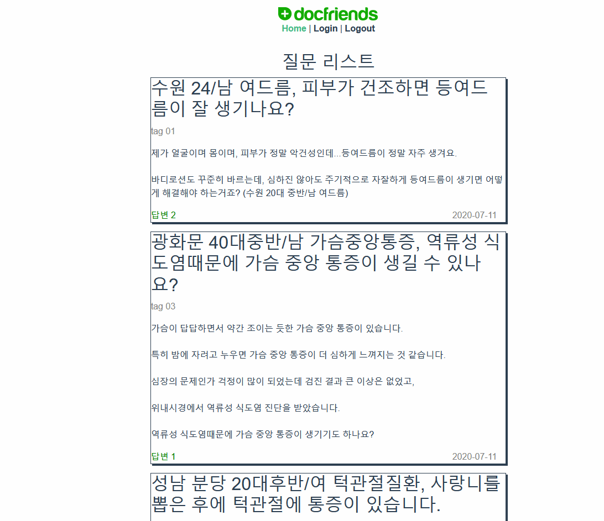
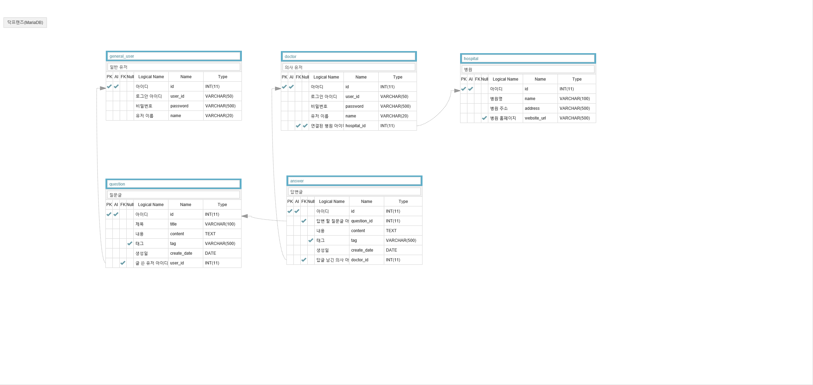

# 실행 모습



1. 실행 시 질문 리스트가 보입니다.
2. 리스트에서 질문 클릭 시 질문 글과 답변 내용이 보여야하는데 로그인되지 않은 상태라 보이지 않습니다.
3. 로그인 후 다시 클릭하니 질문 내용과 답변 내용이 정상적으로 보입니다.
4. 그 후 로그아웃을 하니 다시 질문과 답변이 보이지 않습니다.

<br />

# 설정 방법

- [실행 모습](#실행-모습)
- [설정 방법](#설정-방법)
  - [releases jar를 다운받아 실행 할 경우](#releases-jar를-다운받아-실행-할-경우)
  - [프로젝트 clone하여 실행 할 경우](#프로젝트-clone하여-실행-할-경우)
    - [테스트용 더미 데이터](#테스트용-더미-데이터)
    - [데이터베이스 구조](#데이터베이스-구조)


## releases jar를 다운받아 실행 할 경우

- [Download](https://github.com/jungguji/docfriends-recruit/releases/tag/0.0.1)

1. [mariadb](https://downloads.mariadb.org/)를 설치합니다. 

2. 데이터베이스 명 = "docfriendstask" \
데이터베이스 아이디 = "doc" \
데이터베이스 패스워드 = "qwe123" \
로 데이터베이스를 생성합니다.

3. 테스트용 더미 데이터를 생성합니다.

[더미 데이터](#테스트용-더미-데이터)

## 프로젝트 clone하여 실행 할 경우

1. [mariadb](https://downloads.mariadb.org/)를 설치합니다.

2. backend\src\main\resources 위치에 application-db.properties 파일을 생성합니다.

3. 내용을 아래와 같이 채웁니다.

```properties
spring.datasource.driver-class-name=org.mariadb.jdbc.Driver
spring.datasource.url=jdbc:mariadb://localhost:3306/{데이터베이스 명}
spring.datasource.username={아이디}
spring.datasource.password={비밀번호}
```

4. 테스트용 더미 데이터를 생성합니다.

[더미 데이터](#테스트용-더미-데이터)

<br />
<br />

### 테스트용 더미 데이터

```sql
-- 일반유저 테이블 ---
--drop table `general_user`
CREATE TABLE `general_user` (
    `id` INT(11) NOT NULL AUTO_INCREMENT
    , `user_id` VARCHAR(50) NOT NULL
    , `password` VARCHAR(500) NOT NULL
	, `name` VARCHAR(20) NOT NULL
    , PRIMARY KEY (`id`)
)
ENGINE=InnoDB
DEFAULT CHARSET=utf8
COLLATE=UTF8_DANISH_CI
;

-- TEST DATA --
INSERT INTO `general_user` (`id`, `user_id`, `password`, `name`) VALUES
	(1, 'test@naver.com', 'qwe123', '일반유저 1'),
	(2, 'user_id 2', 'password 2', '일반유저 2'),
	(3, 'user_id 3', 'password 3', '일반유저 3'),
	(4, 'user_id 4', 'password 4', '일반유저 4'),
	(5, 'user_id 5', 'password 5', '일반유저 5'),
	(6, 'user_id 6', 'password 6', '일반유저 6'),
	(7, 'user_id 7', 'password 7', '일반유저 7');
-- 일반유저 테이블 ---

-- 질문 테이블 --
--drop table `question`
CREATE TABLE `question` (
    `id` INT(11) NOT NULL AUTO_INCREMENT
    , `title` VARCHAR(100) NOT NULL
    , `content` TEXT NOT NULL
	, `tag` VARCHAR(500) NULL
	, `create_date` DATETIME NOT NULL
	, `user_id` INT(11) NOT NULL
    , PRIMARY KEY (`id`)
	, INDEX `fk_question_general_user` (`user_id`)
    , CONSTRAINT `fk_question_general_user` FOREIGN KEY (`user_id`) REFERENCES `general_user` (`id`)
)
ENGINE=InnoDB
DEFAULT CHARSET=utf8
COLLATE=UTF8_DANISH_CI
;

-- TEST DATA --
INSERT INTO `question` (`id`, `title`, `content`, `tag`, `create_date`, `user_id`) VALUES
	(1, '수원 24/남 여드름, 피부가 건조하면 등여드름이 잘 생기나요?', '제가 얼굴이며 몸이며, 피부가 정말 악건성인데...등여드름이 정말 자주 생겨요.\\n\\n바디로션도 꾸준히 바르는데, 심하진 않아도 주기적으로 자잘하게 등여드름이 생기면 어떻게 해결해야 하는거죠? (수원 20대 중반/남 여드름)', 'tag 01', '2020-07-11 19:51:04', 1),
	(2, '광화문 40대중반/남 가슴중앙통증, 역류성 식도염때문에 가슴 중앙 통증이 생길 수 있나요?', '가슴이 답답하면서 약간 조이는 듯한 가슴 중앙 통증이 있습니다.\\n\\n특히 밤에 자려고 누우면 가슴 중앙 통증이 더 심하게 느껴지는 것 같습니다.\\n\\n심장의 문제인가 걱정이 많이 되었는데 검진 결과 큰 이상은 없었고,\\n\\n위내시경에서 역류성 식도염 진단을 받았습니다.\\n\\n역류성 식도염때문에 가슴 중앙 통증이 생기기도 하나요?', 'tag 02', '2020-07-11 19:51:04', 2),
	(3, '성남 분당 20대후반/여 턱관절질환, 사랑니를 뽑은 후에 턱관절에 통증이 있습니다.', '왼쪽 아래 사랑니 뽑은지 3-4개월이 됐는데도 귀 밑 턱에 통증이 있습니다.\\n\\n손가락 세개가 들어갈 정도로 입도 벌어지고 딱딱 소리가 나지는 않는데 하품할때나 아침에는 뻐근하게 아픕니다.\\n\\n그 치과에 문의해보면 너무 세개 흔들었나?이러십니다.\\n\\n;; 사랑니 뽑기 전에는 턱에 아무문제가 없었습니다.\\n\\n아! 그리고 제가 턱에 보톡스도 맞았습니다.\\n\\n한 6개월전에. 이때도 아무 문제 없었습니다.\\n\\n어쨋든 이런 증상도 턱관절장애 치료를 받아야 되는지요? 아니면 집에서 찜질정도 해줘도 서서히 없어지는 통증인가요?', 'tag 03', '2020-07-11 19:51:04', 3),
	(4, '질문글 제목 04', '질문내용 04', 'tag 04', '2020-07-11 19:51:04', 4),
	(5, '질문글 제목 05', '질문내용 05', 'tag 05', '2020-07-11 19:51:04', 5),
	(6, '질문글 제목 06', '질문내용 06', 'tag 06', '2020-07-11 19:51:05', 6),
	(7, '질문글 제목 07', '질문내용 07', 'tag 07', '2020-07-11 19:51:05', 7),
	(8, '질문글 제목 08', '질문내용 08', 'tag 08', '2020-07-11 19:51:05', 1),
	(9, '질문글 제목 09', '질문내용 09', 'tag 09', '2020-07-11 19:51:05', 1),
	(10, '질문글 제목 10', '질문내용 10', 'tag 10', '2020-07-11 19:51:05', 7),
	(11, '질문글 제목 11', '질문내용 11', 'tag 11', '2020-07-11 19:51:05', 4);
-- 질문 테이블 --

-- 병원 테이블 --
--drop table `hospital`
CREATE TABLE `hospital` (
    `id` INT(11) NOT NULL AUTO_INCREMENT
    , `name` VARCHAR(100) NOT NULL
    , `address` VARCHAR(500) NOT NULL
	, `website_url` VARCHAR(500) NULL
    , PRIMARY KEY (`id`)
)
ENGINE=InnoDB
DEFAULT CHARSET=utf8
COLLATE=UTF8_DANISH_CI
;

-- TEST DATA --
INSERT INTO `hospital` (`id`, `name`, `address`, `website_url`) VALUES
	(1, '병원 1', '서울시 1', 'website_url 1'),
	(2, '병원 2', '부산 2', 'website_url 2'),
	(3, '병원 3', '제주 3', 'website_url 3');
-- 병원 테이블 --

-- 의사 테이블 --
CREATE TABLE `doctor` (
    `id` INT(11) NOT NULL AUTO_INCREMENT
    , `user_id` VARCHAR(50) NOT NULL
    , `password` VARCHAR(500) NOT NULL
	, `name` VARCHAR(20) NOT NULL
	, `hospital_id` INT(11) NULL
    , PRIMARY KEY (`id`)
	, INDEX `fk_doctor_hospital` (`hospital_id`)
    , CONSTRAINT `fk_doctor_hospital` FOREIGN KEY (`hospital_id`) REFERENCES `hospital` (`id`)
)
ENGINE=InnoDB
DEFAULT CHARSET=utf8
COLLATE=UTF8_DANISH_CI
;

-- TEST DATA --
INSERT INTO `doctor` (`id`, `user_id`, `password`, `name`, `hospital_id`) VALUES
	(1, 'user_id 1', 'password 1', '의사 1', 1),
	(2, 'user_id 2', 'password 2', '의사 2', 1),
	(3, 'user_id 3', 'password 3', '의사 3', 1),
	(4, 'user_id 4', 'password 4', '의사 4', 2),
	(5, 'user_id 5', 'password 5', '의사 5', 3);
-- 의사 테이블 --

-- 답변 테이블 --
--drop table `answer`
CREATE TABLE `answer` (
    `id` INT(11) NOT NULL AUTO_INCREMENT
	, `question_id` INT(11) NOT NULL
    , `content` TEXT NOT NULL
	, `tag` VARCHAR(500) NULL
	, `create_date` DATETIME NOT NULL
	, `doctor_id` INT(11) NOT NULL
    , PRIMARY KEY (`id`)
	, INDEX `fk_answer_question` (`question_id`)
    , CONSTRAINT `fk_answer_question` FOREIGN KEY (`question_id`) REFERENCES `question` (`id`)
	, INDEX `fk_answer_doctor` (`doctor_id`)
    , CONSTRAINT `fk_answer_doctor` FOREIGN KEY (`doctor_id`) REFERENCES `doctor` (`id`)
)
ENGINE=InnoDB
DEFAULT CHARSET=utf8
COLLATE=UTF8_DANISH_CI
;

-- TEST DATA --
INSERT INTO `answer` (`id`, `question_id`, `content`, `tag`, `create_date`, `doctor_id`) VALUES
	(1, 1, '안녕하세요, 닥톡-네이버 지식iN 상담한의사 정동원입니다.\\n\\n피부가 건조하면 모공의 입구가 잘 막히게 됩니다.\\n\\n모공의 입구가 막혀버리면 자잘한 좁쌀여드름이 되는 경우가 있습니다.\\n\\n이런 분들이 건조한 피부인데도 좁쌀여드름이 생기는 타입입니다.\\n\\n바디로션이든 알로에젤이나 수딩젤 같은 보습제를 잘 발라주시는 것은 좋습니다.\\n\\n하지만 이미 생긴 등여드름은 절대 뜯지 마세요.\\n\\n자국이나 흉이 생기기 때문입니다.\\n\\n자잘한 등여드름은 압출해서 없애는 방법도 있습니다만, 필링으로 정리하는 방법이 효과적입니다.\\n\\n단시간이 빨리 정리할 수 있기 때문입니다.\\n\\n그외에 땀흘리는 것이 원인일 수 있으므로, 매일 샤워를 해주시는 것도 예방에 도움이 됩니다.\\n\\n감사합니다.', 'tag 1', '2020-07-11 19:52:28', 1),
	(2, 1, '안녕하세요, 닥톡-네이버 지식iN 상담한의사 박혜린입니다.\\n\\n여드름 흉터로 고민하고 있으시군요.\\n\\n과거에 제대로 관리되는 않은 여드름으로 인해 피부가 울퉁불퉁하게 패이거나, 붉은자국, 거무칙칙한 색소 등이 흔한 여드름 흉터 증상이며, 정도 및 경과에 따라 다르지만 저절로 회복되기 어려운 흉터들이 많습니다.\\n\\n먼저 패인 흉터에는 크게 세 가지 종류가 있습니다.\\n\\n첫 번째는 송곳 모양 흉터로, 얼음송곳처럼 뾰족한 형태의 여드름 흉터입니다.\\n\\n주로 이마나 미간, 볼 양쪽에 잘 생기며, 모공이 변형 되어 생긴 경우가 많습니다.\\n\\n비교적 치료가 어려운 형태의 흉터이며, 차오르기보다는 경계면이 부드러워지는 효과를 기대할 수 있습니다.\\n\\n두 번째는 둥근 접시 모양 흉터로, 패인 흉터의 경계선이 뚜렷하지 않게 함몰되어 있는 형태입니다.\\n\\n보통 볼의 가장자리와 턱 라인 쪽에 나타나며 니들링 및 기계 치료로 피부의 재생을 유도하며 비교적 치료가 쉬운 흉터입니다.\\n\\n세 번째는 박스 모양 흉터로, 경계면이 뚜렷하게 패인 형태의 흉터를 말합니다.\\n\\n깊이가 깊지 않더라도 경계면이 뚜렷해서 눈에 잘 띄고, 여성분들의 경우 화장을 하면 더 도르라져 보이고 화장이 끼어서 신경을 많이 쓰는 흉터의 형태입니다.\\n\\n박스형 흉터는 일반적인 흉터치료에 부가적으로 특징적으로 흉터 아래 부분의 유착을 제거해주고 재생공간을 유도해 줄 수 있는 치료가 필요합니다.\\n\\n다음은 색소성 흉터로, 붉게 남아있는 여드름 자국이나 갈색으로 변색된 색소침착이 있습니다.\\n\\n붉은 자국은 피부의 손상이 미처 다 재생되지 못하여 붉은 상처가 남아있는 것으로 그 부분의 재생을 유도하여 점점 본래의 색으로 회복시켜야합니다.\\n\\n갈색 색소의 경우 주로 표면의 손상으로 인해 침착된 경우가 많으며, 이 경우에는 색소를 탈락시킬 수 있는 치료가 필요합니다.\\n\\n흉터 치료에 있어서 중요한 것은 흉터의 발생시기, 흉터의 깊이, 환자의 재생력, 나이 등입니다.\\n\\n즉, 흉터 치료를 고민하는 지금 이 순간의 실천이 빠를수록 흉터치료의 속도도 높다고 볼 수 있습니다.\\n\\n빠른 시일 내에 상담 받아 보시고 매끈한 피부를 가지시길 바랍니다', 'tag 2', '2020-07-11 19:52:28', 2),
	(3, 3, '안녕하세요, 닥톡-네이버 지식iN 상담한의사 김삼기입니다.\\n\\n가슴이 답답하고 조이는 등의 가슴통증이 발생하면 심장의 문제를 먼저 떠올리게 됩니다.\\n\\n그런데 이러한 경우는 응급한 심장의 문제보다는 위장과 관련하여 가슴통증이 나타나는 경우가 많이 있습니다.\\n\\n검사하신 결과, 심장에 별다른 문제가 없었다면 역류식도염으로 인해 가슴 중앙 통증이 생길 가능성이 높습니다.\\n\\n여러가지 이유로 인해 위장의 운동성이 약해지면 위장으로 들어온 음식을 소화시켜서 배출시키는 기능이 저하되면서 식후에 가스가 많이 차게되고\\n\\n발생한 가스가 위장에서 식도쪽으로 역류하는 상황이 나타나게 됩니다.\\n\\n이렇게 위산이나 가스가 반복적으로 역류하면서 식도쪽으로 압력이 올라오면 가슴 중앙 통증이 생기거나 답답한 증상이 나타날 수 있습니다.\\n\\n이러한 경우에는 가슴 중앙 통증을 치료하기 위해서 먼저 위장 운동성을 회복시켜 위산이나 가스가 가슴쪽으로 역류하지 않도록 해주는 것이 중요합니다.\\n\\n일상생활에서는 본인의 식생활 습관을 한 번 체크해보시기 바랍니다.\\n\\n과식이나 과음을 피하시고 식후에 바로 눕거나 먹고 바로 잠드는 등의 안좋은 생활습관이 있다면 피해주시는 것이 좋습니다.\\n\\n또한 적절한 진료를 통해서 현재 위장 상태를 잘 파악한 후에 위장의 운동성을 회복 시켜줄 수 있는 치료를 진행한다면 좋은 치료 결과가 있을 것이라 생각됩니다.\\n\\n감사합니다.', 'tag 3', '2020-07-11 19:52:28', 3),
	(4, 4, '답글답글답글 4', 'tag 4', '2020-07-11 19:52:28', 4),
	(5, 5, '답글답글답글 5', 'tag 5', '2020-07-11 19:52:28', 4),
	(6, 6, '답글답글답글 6', 'tag 6', '2020-07-11 19:52:28', 2),
	(7, 7, '답글답글답글 7', 'tag 7', '2020-07-11 19:52:28', 2),
	(8, 8, '답글답글답글 8', 'tag 8', '2020-07-11 19:52:28', 1),
	(9, 9, '답글답글답글 9', 'tag 9', '2020-07-11 19:52:28', 3);
-- 답변 테이블 --
```

### 데이터베이스 구조


